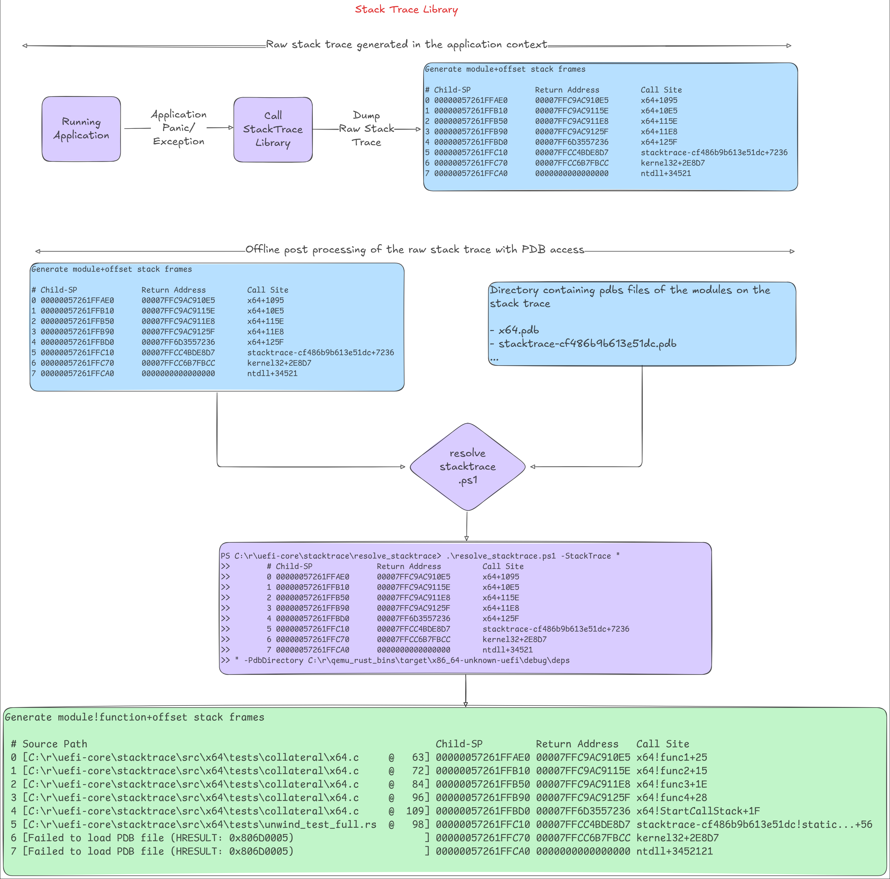

# Stack Trace Library

## Introduction

This library implements the stack walking logic. Given the instruction pointer
and stack pointer, the [API](#public-api) will dump the stack trace leading to
that machine state. It currently does not resolve symbols, as PDB debug info is
not embedded in the PE image, unlike the DWARF format for ELF images. Therefore,
symbol resolution must be done offline. As a result, the "Call Site" column in
the output will display `module+<relative pc>` instead of
`module!function+<relative pc>`. Outside of this library, with PDB access,
these module-relative pc offsets can be resolved to function-relative offsets,
as shown below.

```cmd
PS C:\> .\resolve_stacktrace.ps1 -StackTrace "
>>     # Child-SP              Return Address         Call Site
>>     0 00000057261FFAE0      00007FFC9AC910E5       x64+1095
>>     1 00000057261FFB10      00007FFC9AC9115E       x64+10E5
>>     2 00000057261FFB50      00007FFC9AC911E8       x64+115E
>>     3 00000057261FFB90      00007FFC9AC9125F       x64+11E8
>>     4 00000057261FFBD0      00007FF6D3557236       x64+125F
>>     5 00000057261FFC10      00007FFCC4BDE8D7       patina_stacktrace-cf486b9b613e51dc+7236
>>     6 00000057261FFC70      00007FFCC6B7FBCC       kernel32+2E8D7
>>     7 00000057261FFCA0      0000000000000000       ntdll+34521
>>
>> " -PdbDirectory "C:\pdbs\"

Output:
  # Source Path                                                           Child-SP         Return Address   Call Site
  0 [C:\r\patina\core\patina_stacktrace\src\x64\tests\collateral\x64.c     @   63] 00000057261FFAE0 00007FFC9AC910E5 x64!func1+25
  1 [C:\r\patina\core\patina_stacktrace\src\x64\tests\collateral\x64.c     @   72] 00000057261FFB10 00007FFC9AC9115E x64!func2+15
  2 [C:\r\patina\core\patina_stacktrace\src\x64\tests\collateral\x64.c     @   84] 00000057261FFB50 00007FFC9AC911E8 x64!func3+1E
  3 [C:\r\patina\core\patina_stacktrace\src\x64\tests\collateral\x64.c     @   96] 00000057261FFB90 00007FFC9AC9125F x64!func4+28
  4 [C:\r\patina\core\patina_stacktrace\src\x64\tests\collateral\x64.c     @  109] 00000057261FFBD0 00007FF6D3557236 x64!StartCallStack+1F
  5 [C:\r\patina\core\patina_stacktrace\src\x64\tests\unwind_test_full.rs  @   98] 00000057261FFC10 00007FFCC4BDE8D7 patina_stacktrace-cf486b9b613e51dc!static unsigned int patina_stacktrace::x64::tests::unwind_test_full::call_stack_thread(union enum2$<winapi::ctypes::c_void> *)+56
  6 [Failed to load PDB file (HRESULT: 0x806D0005)                      ] 00000057261FFC70 00007FFCC6B7FBCC kernel32+2E8D7
  7 [Failed to load PDB file (HRESULT: 0x806D0005)                      ] 00000057261FFCA0 0000000000000000 ntdll+34521
```

The input may contain additional whitespace before each frame line, a timestamp in the format shown, or a log prefix
level. Those will be ignored.

## Allowed Examples

Each of these examples will produce the same output:

```cmd
.\resolve_stacktrace\resolve_stacktrace.ps1 -StackTrace "
> 13:39:09.014 : INFO -       # Child-SP              Return Address         Call Site
> 13:39:09.014 : INFO -       0 000000007E96F930      000000007E982668       qemu_q35_dxe_core-2d9bed3cc1f2b4ea+6E1BF
> 13:39:09.014 : INFO -       1 000000007E96F960      000000007EA8B92F       qemu_q35_dxe_core-2d9bed3cc1f2b4ea+12668
> 13:39:09.014 : INFO -       2 000000007E96FA70      000000007E9739E0       qemu_q35_dxe_core-2d9bed3cc1f2b4ea+11B92F
> 13:39:09.014 : INFO -       3 000000007E96FAB0      000000007E98301D       qemu_q35_dxe_core-2d9bed3cc1f2b4ea+39E0
> 13:39:09.014 : INFO -       4 000000007E96FC00      000000007EBE62F4       qemu_q35_dxe_core-2d9bed3cc1f2b4ea+1301D
>
> " -PdbDirectory C:\src\patina-dxe-core-qemu\target\x86_64-unknown-uefi\debug\deps
```

```cmd
.\resolve_stacktrace\resolve_stacktrace.ps1 -StackTrace "
> INFO -       # Child-SP              Return Address         Call Site
> INFO -       0 000000007E96F930      000000007E982668       qemu_q35_dxe_core-2d9bed3cc1f2b4ea+6E1BF
> INFO -       1 000000007E96F960      000000007EA8B92F       qemu_q35_dxe_core-2d9bed3cc1f2b4ea+12668
> INFO -       2 000000007E96FA70      000000007E9739E0       qemu_q35_dxe_core-2d9bed3cc1f2b4ea+11B92F
> INFO -       3 000000007E96FAB0      000000007E98301D       qemu_q35_dxe_core-2d9bed3cc1f2b4ea+39E0
> INFO -       4 000000007E96FC00      000000007EBE62F4       qemu_q35_dxe_core-2d9bed3cc1f2b4ea+1301D
>
> " -PdbDirectory C:\src\patina-dxe-core-qemu\target\x86_64-unknown-uefi\debug\deps
```

```cmd
.\resolve_stacktrace\resolve_stacktrace.ps1 -StackTrace "
> # Child-SP              Return Address         Call Site
> 0 000000007E96F930      000000007E982668       qemu_q35_dxe_core-2d9bed3cc1f2b4ea+6E1BF
> 1 000000007E96F960      000000007EA8B92F       qemu_q35_dxe_core-2d9bed3cc1f2b4ea+12668
> 2 000000007E96FA70      000000007E9739E0       qemu_q35_dxe_core-2d9bed3cc1f2b4ea+11B92F
> 3 000000007E96FAB0      000000007E98301D       qemu_q35_dxe_core-2d9bed3cc1f2b4ea+39E0
> 4 000000007E96FC00      000000007EBE62F4       qemu_q35_dxe_core-2d9bed3cc1f2b4ea+1301D
>
> " -PdbDirectory C:\src\patina-dxe-core-qemu\target\x86_64-unknown-uefi\debug\deps
```



## Prerequisites

This library uses the PE image `.pdata` section to calculate the stack unwind
information required to walk the call stack. Therefore, all binaries should be
compiled with the following `rustc` flag to generate the `.pdata` section in the
PE images:

`RUSTFLAGS=-Cforce-unwind-tables`

In order to preserve stack data about C binaries, this needs to be set in the platform DSC's build options section:

`*_*_*_GENFW_FLAGS   = --keepexceptiontable`

## Supported Platforms

- Hardware
  - X64
  - AArch64

- File Formats
  - PE32+

- Environments
  - UEFI
  - Windows
  - Linux

## Public API

The main API for public use is the `dump()` function in the `StackTrace` module.

```rust
    /// Dumps the stack trace for the given PC, SP and FP values.
    ///
    /// # Safety
    ///
    /// This function is marked `unsafe` to indicate that the caller is
    /// responsible for validating the provided PC, SP and FP values. Invalid
    /// values can result in undefined behavior, including potential page
    /// faults.
    ///
    /// ```text
    /// # Child-SP              Return Address         Call Site
    /// 0 0000005E2AEFFC00      00007FFB10CB4508       aarch64+44B0
    /// 1 0000005E2AEFFC20      00007FFB10CB45A0       aarch64+4508
    /// 2 0000005E2AEFFC40      00007FFB10CB4640       aarch64+45A0
    /// 3 0000005E2AEFFC60      00007FFB10CB46D4       aarch64+4640
    /// 4 0000005E2AEFFC90      00007FF760473B98       aarch64+46D4
    /// 5 0000005E2AEFFCB0      00007FFB8F062310       patina_stacktrace-45f5092641a5979a+3B98
    /// 6 0000005E2AEFFD10      00007FFB8FF95AEC       kernel32+12310
    /// 7 0000005E2AEFFD50      0000000000000000       ntdll+75AEC
    /// ```
    pub unsafe fn dump_with(stack_frame: StackFrame) -> StResult<()>;

    /// Dumps the stack trace. This function reads the PC, SP and FP values and
    /// attempts to dump the call stack.
    ///
    /// # Safety
    ///
    /// It is marked `unsafe` to indicate that the caller is responsible for the
    /// validity of the PC, SP and FP values. Invalid or corrupt machine state
    /// can result in undefined behavior, including potential page faults.
    ///
    /// ```text
    /// # Child-SP              Return Address         Call Site
    /// 0 0000005E2AEFFC00      00007FFB10CB4508       aarch64+44B0
    /// 1 0000005E2AEFFC20      00007FFB10CB45A0       aarch64+4508
    /// 2 0000005E2AEFFC40      00007FFB10CB4640       aarch64+45A0
    /// 3 0000005E2AEFFC60      00007FFB10CB46D4       aarch64+4640
    /// 4 0000005E2AEFFC90      00007FF760473B98       aarch64+46D4
    /// 5 0000005E2AEFFCB0      00007FFB8F062310       patina_stacktrace-45f5092641a5979a+3B98
    /// 6 0000005E2AEFFD10      00007FFB8FF95AEC       kernel32+12310
    /// 7 0000005E2AEFFD50      0000000000000000       ntdll+75AEC
    /// ```
    pub unsafe fn dump() -> StResult<()>;
```

## API usage

```rust
    // Inside exception handler
    let stack_frame = StackFrame { pc: x64_context.rip, sp: x64_context.rsp, fp: x64_context.rbp };
    StackTrace::dump_with(stack_frame); // X64
    let stack_frame = StackFrame { pc: aarch64_context.elr, sp: aarch64_context.sp, fp: aarch64_context.fp };
    StackTrace::dump_with(stack_frame);    // AArch64

    // Inside rust panic handler and drivers
    StackTrace::dump();
```

## Reference

More reference test cases are in `src\x64\tests\*.rs`
