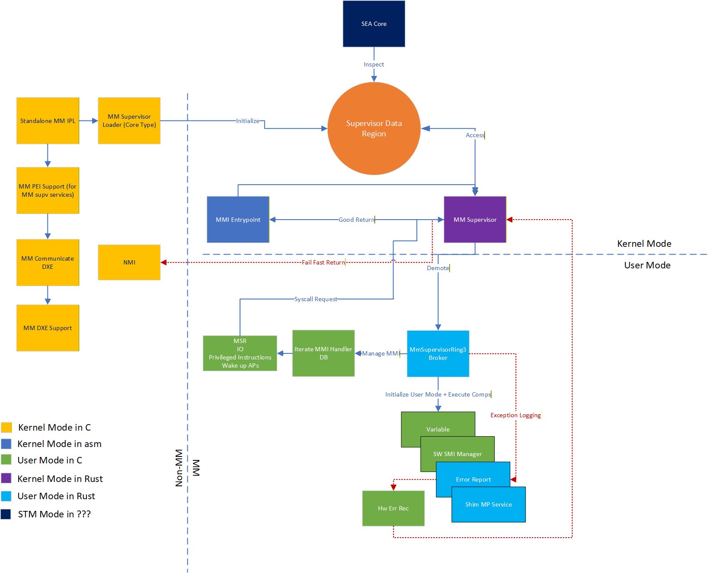

# RFC: `MM Supervisor in Rust`

This RFC proposes a Rust-based supervisor to manage management mode (MM) operations using the Patina framework.

## Change Log

- 2025-10-27: Initial RFC created.

## Motivation

Supervision in MM is critical for secure and reliable firmware execution, as it handles sensitive tasks such as
system management interrupts (SMIs) and other privileged operations. By implementing the MM supervisor in Rust,
we aim to leverage Rust's safety guarantees, memory management, and concurrency features to enhance the robustness
of MM operations.

## Technology Background

### Standalone MM

Standalone MM is a PI specification defined operation for MM, where the MM core and its drivers run independently from the
non-MM environment. This allows for better isolation and security, as the MM code can operate without interference from the
main operating system or other firmware components.

See reference: [PI specification v1.9](https://uefi.org/specs/PI/1.9/V4_Overview.html#initializing-management-mode-in-mm-standalonemode)

### MM Supervisor

A project MU component implements a standalone MM supervisor in C. This component provides supervised MM functionality.
Specifically, it manages MM handlers, MM protocol database, memory mapping, context switching, and secure execution of MM
code. However, it lacks the safety and modern features that Rust can offer.

The goal of this RFC is to re-implement the MM supervisor functionality in Rust using the Patina framework,
which will provide a safer and more efficient implementation.

### Cross-Architecture Support

The standalone MM supervisor in C supports only x86_64 architecture. The Rust implementation aims to support both
x86_64 and AArch64 architectures in terms of isolation, ensuring broader compatibility across different platforms.

### Technical Details

This section will discuss the technical details of the Rust-based MM supervisor implementation.



#### Standalone MM Bootstrapping (the IPL)

The intention is to leverage the existing EDK2 components to open the MMRAMs, locate the "standalone MM core", execute it
in MMRAM, produce the necessary PPIs, and runtime protocols. The MM supervisor specific services, such as MM interfaces that
route to supervisor specific MM handlers, will be provided in a light weighted C component. Specifically, given the supervisor
interfaces are no longer needed during runtime, these MM supervisor DXE agents will be marked as boot services drivers (in
contrast to runtime drivers).

#### MMI Entry Point

This entry point is the assembly routine responsible for handling incoming MMIs. It will transition the CPU from 16bit mode
all the way to 64bit mode, setting up the necessary environment for MM execution.

This section is expected to be mostly similar to an implementation for Project MU's SMM Enhanced Attestation (SEA), which
separated the critical jump pointers to data sections, allowing for easier inspection and updates.

The main differences will be:

1. The MMI entry point will need to handle MMI targetting evaluation (supervisor vs Ring3 broker)
2. The MMI entry point will need to fix up an extra jump pointer to the Ring3 broker entry point
3. The MMI entry point will enforce SMAP in CR4 for MM user mode execution

#### MM Foundation Setup

The MM foundation setup involves the following key tasks:

- Initialize memory services specific to MM
- Initialize copied HOBs from non-MM environment
- Discover Standalone MM drivers from FV hobs
- Setup up stack buffer for all processors and both supervisor and user modes
- Reserve necessary MMRAM regions for save states
- Discover and load MM supervisor in Rust into MMRAM
- Discover and load MM Ring3 broker in Rust into MMRAM
- Install MMI entry point from the previous section and fix up necessary jump pointers
- Initialize IDT and GDT content for MM execution
- Setup page tables for MM protections
- Map all the regions from MMRAM
- Block access to non MMRAM regions by default
- Unblock access to necessary non-MM regions based on reported HOBs
- Register MM supervisor handlers for needed events
- Prepare necessary MM communication buffers based on reported hobs
- Initialize security policies
- Initialize callgates and syscall dispatchers
- Lock down non MMRAM region page tables to read-only
- Invoke the first MMI to transfer control to the MM supervisor in Rust.

Note that the MM relocation should be already handled by the SmmRelocationLib from PEIM before entering MM.

The global state (data) will be stored in MMRAM, in a dedicated supervisor region that is ready to to handed off to the
Rust MM supervisor.

#### MM Supervisor in Rust

Once the MM foundation setup is complete, the first MMI will transfer control to the MMI entry point block, which will
then jump into the Rust MM supervisor main function that is being patched in the previous section.

With the transitioning to Rust MM supervisor, the supervisor mode agent will inherit the prepared state section from the
previous section.

##### MMI Targeting

The Rust MM supervisor in the case of incoming MMIs will perform a check on the incoming RCX value to determine if the MMI
is targeted for the supervisor or for the Ring3 broker. If it is targeted for the supervisor, it will dispatch to the appropriate
supervisor handler. If it is targeted for the Ring3 broker, it will be transparent and quickly demote to MM user mode after
performing necessary checks.

Note that this is different from the existing C implementation, where the MMI targeting check is performed in a shared buffer
between supervisor and normal world (aka. `MM_BUFFER_STATUS`).

##### MMI Management

Regardless of the target, the Rust MM supervisor will copy the entire MM communication buffer to the into corresponding
MMRAM region, specific to the targetting mode, to ensure data integrity and protect from DMA based data tampering.

If it is targeted for supervisor, the Rust MM supervisor will locate the appropriate supervisor handler and try to dispatch
it. If the handler is not found, it will return an error status back to the caller.

If it is targeted for Ring3 broker, the Rust MM supervisor will save all the syscall related MSRs, FXSAVE area, and other
necessary context into the dedicated region and then demote to MM user mode to execute the Ring3 broker.

The Ring 3 broker section will detail more about how the Ring3 broker is executed and how the context is restored back to
supervisor mode.

##### Ring Transitioning

The Rust MM supervisor will handle the transitioning between supervisor mode and MM user mode for Ring3 broker execution.

The demotion to MM user mode will be done via callgates by setting up the necessary callgates and task state segments (TSS)
during the foundation setup phase. Before transitioning to MM user mode, the Rust MM supervisor will prepare the syscall
context in the dedicated region, including parameters, MSRs, FX registers, supervisor stack pointer, and return segment selector.

During user mode execution, the Ring3 broker will request elevated operations and trigger a syscall interrupt to transition
back to supervisor mode. The Rust MM supervisor will handle the syscall interrupt through a syscall dispatcher, restoring
the saved context and stack before resuming supervisor mode execution.

The requested operation will be verified against the security policies before being executed. After the operation is completed,
the Rust MM supervisor will prepare the return value and transition back with sysret to MM user mode to continue Ring3
broker execution.

Note that this will executed on all processors, and the Rust MM supervisor will ensure proper context switching and isolation
between different processors.

##### Syscall Dispatching

The expected syscall operations will be the same as the existing C implementation, including:

```c
// ======================================================================================
//
// Define syscall method
//
// ======================================================================================
///
/// To keep the enum value consistant, please explicitly specify the value for each enum item;
/// if you add/remove/update any enum item, please also add/remove/update related information in SyscallIdNamePairs array
///
typedef enum {
  SMM_SC_RDMSR      = 0x0000,
  SMM_SC_WRMSR      = 0x0001,
  SMM_SC_CLI        = 0x0002,
  SMM_SC_IO_READ    = 0x0003,
  SMM_SC_IO_WRITE   = 0x0004,
  SMM_SC_WBINVD     = 0x0005,
  SMM_SC_HLT        = 0x0006,
  SMM_SC_SVST_READ  = 0x0007,
  SMM_SC_PROC_READ  = 0x0008,
  SMM_SC_PROC_WRITE = 0x0009,
  SMM_SC_LEGACY_MAX = 0xFFFF,
  // Below is for new supervisor interfaces only,
  // legacy supervisor should not write below this line
  SMM_REG_HDL_JMP     = 0x10000,
  SMM_INST_CONF_T     = 0x10001,
  SMM_ALOC_POOL       = 0x10002,
  SMM_FREE_POOL       = 0x10003,
  SMM_ALOC_PAGE       = 0x10004,
  SMM_FREE_PAGE       = 0x10005,
  SMM_START_AP_PROC   = 0x10006,
  SMM_REG_HNDL        = 0x10007,
  SMM_UNREG_HNDL      = 0x10018,
  SMM_SET_CPL3_TBL    = 0x10019,
  SMM_INST_PROT       = 0x1001A,
  SMM_QRY_HOB         = 0x1001B,
  SMM_ERR_RPT_JMP     = 0x1001C,
  SMM_MM_HDL_REG_1    = 0x1001D,
  SMM_MM_HDL_REG_2    = 0x1001E,
  SMM_MM_HDL_UNREG_1  = 0x1001F,
  SMM_MM_HDL_UNREG_2  = 0x10020,
  SMM_SC_SVST_READ_2  = 0x10021,
  SMM_MM_UNBLOCKED    = 0x10022,
  SMM_MM_IS_COMM_BUFF = 0x10023,
} SMM_SYS_CALL;
```

Note that the new supervisor interfaces (from 0x10000 and above) will be exclusive to the MM supervisor based implementation
and will not have corresponding verification against the platform policies.

However, for a given non legacy syscall, the Rust MM supervisor must ensure that the supplied pointers and buffers are valid
and exclusively point to user mode MMRAM regions.

For the legacy syscalls (from 0x0000 to 0xFFFF), the Rust MM supervisor will verify the requested operations against the
platform supplied security policies before executing them. See the next section for more details on security policies.

For page allocation and free syscalls, the Rust MM supervisor will manage a dedicated page pool for MM user mode allocations.

##### Security Policies Logic

The policy structure will continue to use the same format as the existing C implementation for compatibility with existing
operating systems and toolings.

The Rust MM supervisor will inherit the prepared security policies from the foundation setup phase. It will enforce the
policies during syscall dispatching, ensuring that only allowed operations are executed based on the platform defined policies.

The platform supplied policy should include 4 main categories:

- MSR Access Policies
- I/O Port Access Policies
- Privileged Instruction Access Policies
- Save State Access Policies

The platform could choose to enforce strict policies that only allow a limited set of operations or more lenient policies
by configuring the policies to allow by default.

Depending on the policy entry content, the syscall dispatcher will either allow or deny the requested operation. For allowed
operations, syscall will replay the requested operations and return the result back to the Ring3 broker.

For denied operations, the syscall dispatcher will return an error status and invoke the telemetry reporting mechanism to
log the violation event. See more on telemetry reporting in the next sections.

##### Page Table Management

The Rust MM supervisor will manage the page tables for both supervisor and MM user modes.

As the MM core does not have a GCD, it will need to manage the page tables directly. In the foundation setup phase, the
Rust MM supervisor loader will allocate a dedicated page pool for page table usage and security policy reporting.

The loader will then set up the initial page tables, including mapping all necessary MMRAM regions, unmapping non-MMRAM
regions, and unblock the regions requested from non-MM environments.

At the end of the MM foundation setup, the loader will page table to read-only to prevent tampering from MM code, marking
the supervisor code sections as supervisor executable and supervisor data sections as supervisor non-executable.

During runtime, the Rust MM supervisor will manage page table updates for MM user mode allocations and frees by disabling
and re-enabling the page table protections through CR0 WP bit manipulation.

For user mode syscall requests that involve page table updates, the Rust MM supervisor will validate the requested
operations against the security policies before applying them.

Specifically, only runtime data and code allocations are allowed, and the allocated regions will be marked as RW + U for
data and RX + U for code sections. However, since RX + U will make the region finalized for the user mode, the syscall interface
will require the caller to specify the buffer location and size upfront.

##### Memory Security Policy Reporting

When external agent indicates ready to lock event, MM supervisor will cease to accept any further unblock requests and produce
a report of all the unblocked regions for attestation purposes.

Whenever external agent requests the security policy report, the MM supervisor will generate a fresh report based on the
current page table but compare it against the snapshot reported during ready to lock event to ensure integrity.

Note that if memory policy is queried before ready to lock event, the MM supervisor will produce a report based on the
current page table and lock down the unblock requests going forward.

The produced report will be concatenated with the platform supplied policy of 4 other categories and hand off to the non-MM
environment supplied buffer for attestation purposes.

##### Supervisor Pool Allocator

The supervisor pool allocator will stem from dedicated supervisor pages and does not interact with MM user mode allocations.

##### Multiprocessor (MP) Support

The MP support will be similar to the existing C implementation, where the Rust MM supervisor loader will initialize all
processors during the foundation setup phase.

Upon invocation of each MMI, Rust MM supervisor will rendezvous all processors to ensure proper synchronization before
handling the MMI.

After rendezvous, the Rust MM supervisor will perform necessary BSP elections and put the APs into the holding pen, and wait
for the BSP to complete the MMI handling before releasing the APs back to normal execution.

Should either the MMI handlers needs to send signals to all processors to perform certain operations, or the BSP that handles
the MMI needs to write to the command buffer with provided function pointer and arguments for APs to execute, the Rust MM
supervisor will flush the page tables to ensure all processors have the most up-to-date view of memory, and then dispatch
to the function pointer that is requested.

If the requested operation is initiated from MM user mode, the Rust MM supervisor will first inspect the requested operation
and ensure the operation belongs to user mode code region before populating the function pointer and arguments into the
command buffer. Upon dispatching, the Rust MM supervisor will demote APs to user mode through callgate before executing
the requested operation. During the operation, should the user mode operations require supervisor mode services, the APs
will trigger syscall interrupts to transition back to supervisor mode to handle the requests, if this is allowed by the
security policies.

#### MM Ring3 Broker in Rust

This component will run in the MM user mode, providing a safe interface for MM clients to interact with the MM supervisor.
The elevated operations will be requested through syscalls, which will be handled by the Rust MM supervisor after security
policy guided adjudication.

This component will be responsible for:

- Initializing the MM user mode environment
- Setting up telemetry reporting and fail fast component
- Providing shim version of MP services
- Hosting pool allocator for MM user mode allocations
- Hosting page allocator for MM user mode through syscalls
- Hosting protocol database for MM user mode
- Hosting MMI handler database for MM user mode
- Registering and dispatching fundamental events during boot phase for MM user mode
- Dispatching other MM user mode drivers

##### Commonality between Architectures

The initialization routine and pool allocator will be common between x86_64 and AArch64 architectures and could be inherited
from the Patina framework with minimal adaptations.

The same applies to the protocol database, event registration and dispatching, and dispatching of MM user mode drivers.

##### X64 Ring3 Broker Bootstrapping

This section will detail the x86_64 specific bootstrapping steps for the Ring3 broker.

The Ring3 broker will have one and only one entry point, which will be patched into the MMI entry point during the foundation
setup phase.

The entry point will support 3 types of invocations:

- Initialization: The first invocation will be from the Rust MM supervisor during the foundation setup phase to initialize
  the Ring3 broker environment.
- Normal MMI handling: Subsequent invocations will be from the Rust MM supervisor during normal MMI handling to demote
  to MM user mode for Ring3 broker execution.
- Exception Handling: Invocations from the supervisor to log exceptions.

When the supervisor demotes to MM user mode for Ring3 broker execution, RCX will contain the opcode for needed operation.

----------------------------------------

#### Telemetry Reporting and Fail Fast Mechanism

The telemetry reporting and fail fast mechanism will be hosted in the Rust ring3 broker in a form of component. So that
the coverage will be comprehensive since the boot phase.

When this operation is invoked from supervisor mode, the Rust MM supervisor will pass the some information from the exception
site to the Ring3 broker for logging, including:

- Instruction pointer (RIP)
- Exception type

The exception logging will be done in the Ring3 broker, which will format the information log entry into `gMuTelemetrySectionTypeGuid`
defined section. If the UEFI variable service is available, the Ring3 broker will attempt to write the log entry into a
HwErrRec UEFI variable for persistence across reboots. Otherwise, it will store the log entry into CMOS for retrieval across
reboots.

Fail fast mechanism will be HEST ACPI table based. Once the telemetry reporting routine is completed, the Ring3 broker
will inject a fatal error into the HEST table before returning back to supervisor mode.

Once back in supervisor mode, the Rust MM supervisor will inject an NMI into the current core before returning, which will
be handled by the existing NMI handler from the non-MM component, be it Patina core or OS.

The MM supervisor will cease to accept any further MMIs once the fail fast mechanism is triggered.

The point of implementing fail fast mechanism is to extract the corresponding non-MM crash dump for further analysis. This
is especially important for analyzing why syscall dispatcher run into denied operations.

#### DXE Agents

Once systems enters DXE phase, the system will continue to use MM communication DXE driver from EDK2.

However, the MM DXE Support driver will provide the MM supervisor specific services, such as MM interfaces that route to
supervisor specific MM handlers.

#### SMM Enhanced Attestation (SEA) Integration

With the Rust MM supervisor in place, we can integrate SMM Enhanced Attestation (SEA) features to enhance the security
of the MM environment.

Given the supervisor loader has been separated from the MM core, and the prepared data is handed off to the Rust MM supervisor
as data _section_, we can minimize the security rules needed for SEA to inspect the passed data section for attestation purposes.

In addition, for the remainging global data that is needed by the Rust MM supervisor, we can keep applying the derelocation
techniques from SEA against the rules for MM core verification.

### Test Plan

TBD
