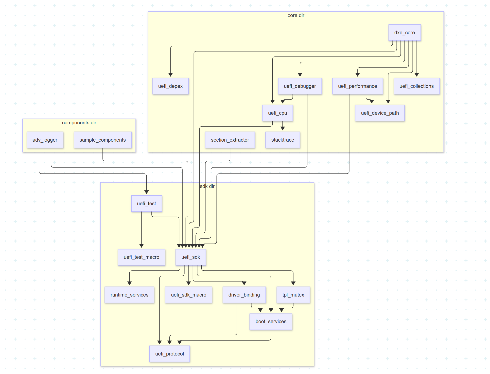
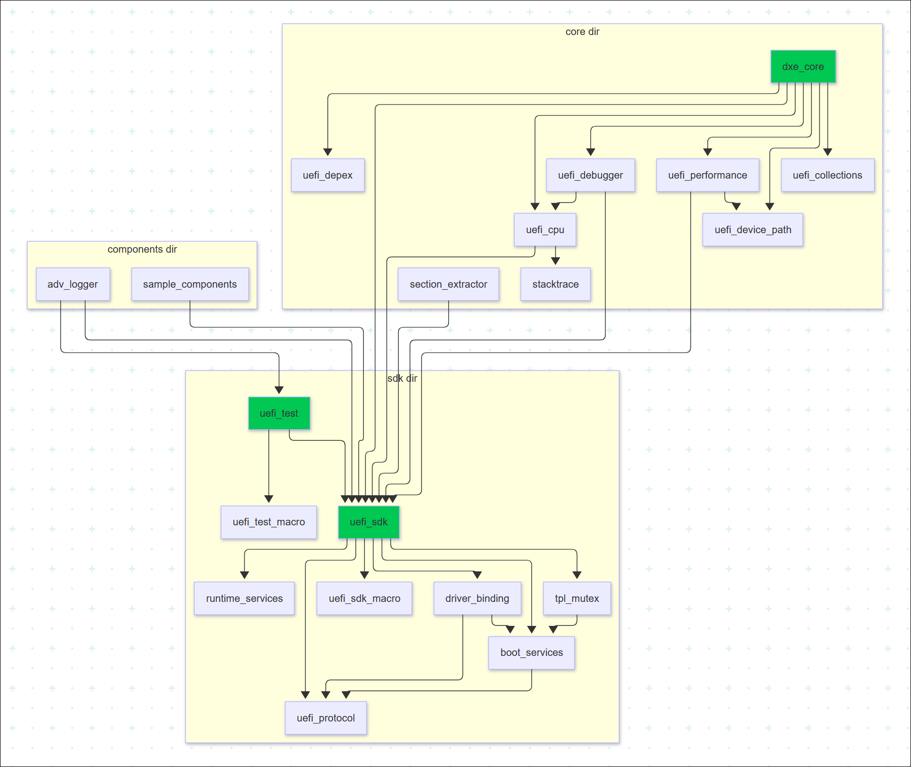

# RFC: Categorizing and Renaming Patina Crates for Consistency

This RFC proposes categorizing existing Patina crates as either public or
internal and renaming them to follow a consistent naming style, as outlined in
the original [Patina Repo
RFC](https://github.com/OpenDevicePartnership/patina/blob/main/docs/src/rfc/text/0006-patina-repo.md#requirements).

## Change Log

- 2025-05-08: Initial draft of RFC.

## Motivation

Following the creation of the Patina monorepo, approximately 21 crates have been
colocated. These crates currently use inconsistent naming conventions, and in
many cases, do not clearly indicate their intended usage. This RFC proposes
standardizing the naming of all existing crates to ensure consistency across the
repository

## Technology Background

This RFC does not impact any specific technology or alter the logical structure
of the existing crates. The physical structure also remains unchanged, except
for updating the crate names and their corresponding directory names to follow
the new naming conventions.

## Goals

1. The main goal of this RFC is to classify existing crates into public vs.
   internal-only categories, and ensure each crate has a consistent name that
   clearly indicates its intended usage.
2. Avoid name conflicts with existing crates on crates.io

## Requirements

1. Public crates must be prefixed with `patina_`.
2. Internal-only crates must be prefixed with `patina_internal_`.
3. In addition to the above guidelines, any inconsistent crate names should be
   renamed to improve clarity.
4. The crate's directory must match its name.
5. Renaming crates will require updating all references in the code to reflect the new names.

- **Public vs. Internal** - Deciding whether a crate should be internal-only or
public is subjective. We have not yet completed the categorization of all
crates. Below is the current dependency graph (DAG) of the crates, which will
aid in further analysis and guidance.



## Unresolved Questions

## Prior Art

This section outlines the crate organization prior to the implementation of this
RFC.

### Prior Crate Organization

```text
├── components
│   ├── adv_logger
│   └── sample_components
├── core
│   ├── dxe_core
│   ├── section_extractor
│   ├── stacktrace
│   ├── uefi_collections
│   ├── uefi_cpu
│   ├── uefi_debugger
│   ├── uefi_depex
│   ├── uefi_device_path
│   └── uefi_performance
└── sdk
    ├── boot_services
    ├── driver_binding
    ├── runtime_services
    ├── tpl_mutex
    ├── uefi_protocol
    ├── uefi_sdk
    ├── uefi_sdk_macro
    ├── uefi_test
    └── uefi_test_macro
```

### New Crate Organization

The identified public crates from the dependency graph are shown below, along
with the proposed crate names. Additional input is needed to finalize this
classification.



```text
  Existing                             New
├── components                   ├── components
│   ├── adv_logger               │   ├── patina_internal_adv_logger
│   └── sample_components        │   └── patina_internal_sample_components
├── core                         ├── core
│   ├── dxe_core                 │   ├── patina_dxe_core
│   ├── section_extractor        │   ├── patina_internal_section_extractor
│   ├── stacktrace               │   ├── patina_internal_stacktrace
│   ├── uefi_collections         │   ├── patina_internal_collections
│   ├── uefi_cpu                 │   ├── patina_internal_cpu
│   ├── uefi_debugger            │   ├── patina_internal_debugger
│   ├── uefi_depex               │   ├── patina_internal_depex
│   ├── uefi_device_path         │   ├── patina_internal_device_path
│   └── uefi_performance         │   └── patina_internal_performance
└── sdk                          └── sdk
    ├── boot_services                ├── patina_internal_boot_services
    ├── driver_binding               ├── patina_internal_driver_binding
    ├── runtime_services             ├── patina_internal_runtime_services
    ├── tpl_mutex                    ├── patina_internal_tpl_mutex
    ├── uefi_protocol                ├── patina_internal_protocol
    ├── uefi_sdk                     ├── patina_sdk
    ├── uefi_sdk_macro               ├── patina_internal_sdk_macro
    ├── uefi_test                    ├── patina_test
    └── uefi_test_macro              └── patina_internal_test_macro
```

## Alternatives

- Keep the current crate organization.
  - Not recommended, as it does not fulfill the goals of this RFC.
