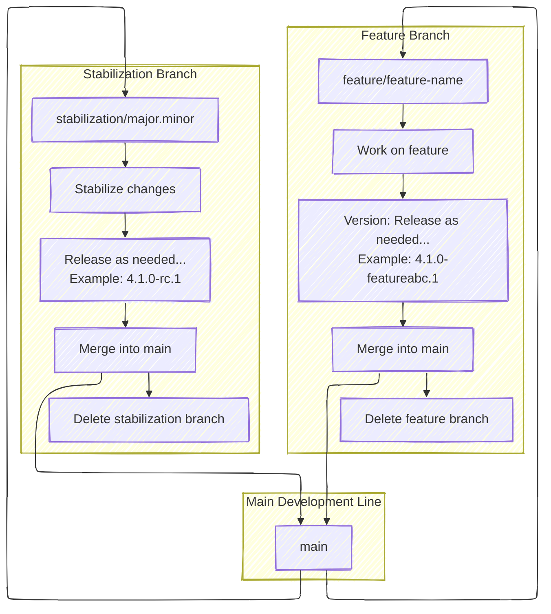

# RFC: Patina Release Process

This RFC proposes a process for releasing Patina crates.

## Change Log

- 2025-07-28: Initial draft of RFC.
- 2025-07-29: Add more granular crate versioning to the unresolved questions section.
- 2025-07-30:
  - Add feature and stability branching process
  - Clarify crate versioning process
  - Clarify open source versioning plan
  - Add requirement that hot fixes will only occur on the greatest version of a release
- 2025-08-05:
  - Simplify language in the hot fix process
  - Add release note organization requirement for crates sharing the same version
- 2025-08-13:
  - Change the scheduled release day from Monday to Tuesday to discourage rushed releases at the start of the week.

## Motivation

As Patina nears its public release and shipping in production, the release process needs to be more formally defined.

Consumers need to understand how to anticipate Patina releases, how to request releases, and how hot fixes are
handled. This RFC proposes a process for Patina crate releases in the `patina` repositories that contain library
crates, such as `patina`, `patina-paging`, and `patina-mtrr`. This RFC does not cover aspects of the release process
once a release is made, such as testing and validation criteria.

## Technology Background

This RFC does not impact any technology specifically. The [Semantic Versioning 2.0.0 specification](https://semver.org/)
is used as a reference for versioning and release process. The implementation of automated processes is outside the
scope of this RFC, but it is expected that the process will be implemented using GitHub Actions or similar
automation tools.

## Goals

1. Provide a clear and automated process for releasing Patina crates.
2. Ensure that releases are made in a timely manner and that consumers can anticipate releases.
3. Provide flexibility in the release process to support releases on demand.
4. Ensure that hot fixes can be made when necessary without disrupting the main release process.
5. Ensure multiple hot fixes can clearly be made on a single base version.
6. Ensure hot fix consumers clearly understand how to consume hot fixes.
7. Ensure that breaking changes are clearly documented and communicated to consumers.
8. Ensure that releases are versioned according to semantic versioning.
9. Ensure that release notes are automatically generated and published with each release.
10. Ensure that the release process is automated as much as possible to reduce manual effort and errors.
11. Provide a model for changes to stabilized while not impacting the main development branch.

## Requirements

### Release Notes

- Are generated automatically in a GitHub release draft as pull requests are merged.
- Content is determined as follows:
  - Title: Based on the pull request title.
  - Body: Based on the pull request description.

### Release Version Details

- Is maintained as a semantic version following the [Semantic Versioning 2.0.0 specification](https://semver.org/).
- Is automatically updated in the GitHub release draft based on the labels associated with the pull
  requests that compose the release.
  - The version is determined as follows:
    - Increment to Major:
      - 'impact:breaking-change'
      - 'semver:major'
    - Increment to Minor:
      - 'semver:minor'
      - 'type:design-change'
      - 'type:enhancement'
      - 'type:feature-request'
    - Increment to Patch:
      - 'impact:non-functional'
      - 'semver:patch'
      - 'type:bug'
      - 'type:documentation'
    - Default: Update patch

### Release Process Details

- Is automated and triggered by a GitHub action at 7am Pacific time on Tuesday on cadence decided in the project.
  - This RFC proposes a weekly release cadence.
  - May be triggered by a Patina team member at any time outside of the scheduled time.
  - The release is composed of changes in the `main` branch that have been merged since the last release.
- Bases the releases notes and version on the GitHub draft that was automatically drafted after
  each pull request merge.
- Publishes the release to the active project crate registry (e.g. crates.io).
- Has special requirements for a breaking change:
  1. The breaking change must be documented in the pull request description with exact instructions on how to
      migrate from the previous version to the new version.
  2. The breaking change must be labeled with 'impact:breaking-change'.
  3. Prior to merging a breaking change:
      - If any content is pending for release, that content must be released first.
      - The breaking change (or `stabilization` branch) is then merged into the `main` branch.
      - The breaking change is immediately released as a new version.

### Crate Versioning

- All crate versions share the same version that is incremented based on the release process. This version matches
  the GitHub repository version.
  - This not a "strong" requirement and may be reviewed again the future if a compelling use case arises for more
    granular crate versioning. At a minimum, the "core" and "SDK" crates are expected to share the same version.

- Note: Since all crates will have the same version, the release notes must be organized to break down changes by
  crate. This will allow a given crate consumer to filter the changes relevant to them. The implementation details of
  how to achieve this are outside the scope of this RFC.

### Branching

- The `main` branch is the primary development branch.
  - Any release made from a non-`main` branch must have a pre-release identifier in the version.
- A `feature` branch may be created for an involved feature or enhancement.
  - The `feature` branch is merged into the `main` branch when the feature is complete and ready for release.
  - The `feature` branch is deleted after it is merged.
  - **Branch name**: `feature/<feature-name>`
  - **Version Format**: `<major>.<minor>.<patch>-feature<feature-name>.<feature_release_number>`
    - **Example**: `4.1.0-featureabc.1`
  - Changes must be submitted by PR, however, PR requirements may vary from those in the `main` branch. The
    final feature merge to `main` will be subject to the normal `main` branch PR requirements.
- Prior to an upcoming major releases, any breaking changes or other changes not considered stable for release
  are staged in a `stabilization` branch.
  - The `stabilization` branch is used to stabilize features and enhancements before they are merged into the `main`
    branch.
  - The `stabilization` branch is deleted after it is merged.
  - **Branch name**: `stabilization/<major>.<minor>`
  - **Version Format**: `<major>.<minor>.<patch>-rc.<rc_release_number>`
    - **Example**: `4.1.0-rc.1`
  - PR requirements are the exact same as those to the `main` branch.

- The time when either a `feature` or `stabilization` branch is merged to `main` is decided within the project by the
  maintainers and authors of the changes in the branch. Any changes in a branch blocking merge must be removed from
  the branch prior to merge and then added to the next equivalent branch.



## Unresolved Questions

- What constitutes a "breaking change"?
  - There is a desire to reduce the amount of major version churn by establishing Patina-specific guidelines for
    breaking changes. Once this is formalized, the guidelines will be added to this RFC.

## Prior Art (Existing PI C Implementation)

Various projects have incorporated semantic versioning in their release processes. This process is largely based on
the Semantic Versioning 2.0.0 specification. In terms of related open source firmware project, Tianocore follows a
[stable tag](https://github.com/tianocore/tianocore.github.io/wiki/EDK-II-Release-Planning) process that releases on
a quarterly interval with freeze periods preceding the release point. [Project Mu](https://microsoft.github.io/mu/) has
an [automated release note process](https://github.com/microsoft/mu_devops?tab=readme-ov-file#release-drafting) that
portions of this proposal are based on.

## Proposed Release Process

Patina makes official releases on as the project determines necessary. This RFC covers three types of releases:

- **Regular Releases**: A release is made on Tuesday each week. If there are no changes, the release is not made. The
  release process is automated including the release notes, versioning, and publishing to crates.io. However, a Patina
  team member with proper access can always make a release at any time.
  > Note: Tuesday is chosen as it provides the maximum amount of time for the Patina team to be available for feedback
  and support of the release during the given work week and discourages rushed changes over the weekend or at the
  start of the week.
  - If Tuesday falls on a holiday, the automated release process still makes the release on Tuesday, but the Patina team
    will not be available for support until the next business day.
  - More frequent releases are encouraged to provide greater granularity of changes and to avoid large releases
    that may be harder to test and validate.
- **Requested Releases**: A release may be requested by a non-Patina team member to unblock a platform or feature
  that depends on the change.

  A requested release may only be made for changes that have already been merged into the `main` branch and are
  pending in a draft GitHub release. The requestor must open a GitHub issue task and simply request the release be
  made and explicitly state which changes are needed so the Patina team member can ensure the release successfully
  resolves the request. The task is closed by the Patina team member once the release is made.
- **Hot Fixes**: A hot fix is made when a critical change needs to be applied on a previous release.
  > Note: It is always preferred to use the latest official release when possible. Hot fixes introduce maintenance
  overhead and should be avoided when possible.

  A "Hot Fix" issue template will be made available in the GitHub repository to request a hot fix. The template
  will include the following fields:

  - `Title`: Patina Hot Fix Release Request
  - `Description`:
    - `Patina Base Version: <ver>`
    - `Request Reason: <reason(s)>`
    - `Exact Changes Needed: <change(s)>`
    - `Requested Delivery Date: <date>`
      - Examples
        - `<reason(s)>`: Needed to enable unblock feature a on x and y platforms
        - `<change(s)>`: Include commit ae4b134 from the main branch
        - `<date>`: 8/1/2025

  `<date>` must be at least the next business day from the request date. For example, a request cannot be made on
  Friday at 11am for a release on Friday. At the earliest, the release will be made on Monday by 5pm. All times are
  based on Pacific time unless noted otherwise. The Patina team will acknowledge the expected release date in the
  discussion section of the work item request. Note that the requested date may not be feasible; try to plan a
  special release request as early as possible.

  Please consider if you can simply take a newer release and avoid a hot fix.

## Hot Fix Process

  Hot fixes are made when an out-of-cycle release is requested on a `base change` in which the `main` branch already
  contains additional commits on top of the `base change` (`base change` is not the tip of the branch).

  In this case, a new branch is created from `base change` with the minimum commits needed to include `Exact Changes
  Needed`. The branch follows the naming convention "hotpatch/\<Patina Base Version\>/\<Hot Fix Number\>". Hot fix crate
  versions are versioned as "\<Patina Base Version\>-hotfix.\<Hot Fix Number\>". For example, if a hot fix is requested
  on Patina v4.1.0 and it is the second hot fix requested on that base version, the following branches will exist with
  the following versions produced from those branches:

- Request 1:
  - Branch: `hotpatch/4.1.0/1`
  - Version: `4.1.0-hotfix.1`
- Request 2: `hotpatch/4.1.0/2`
  - Version: `4.1.0-hotfix.2`

  `Request 1` may have come from "Team A" and `Request 2` may have come from "Team B" and contain an entirely different
  change on top of the `4.1.0` release. Hot fixes are not intended serve as long term branches. Once the hot fix is
  made, the hot fix branch is "locked" and no further changes are made to it. Hot fixes are recommended on the
  greatest patch version of a major release. For example, if `4.2.1` is the latest release, then hot fixes may be
  requested on `4.2.1` but not `4.2.0`, `4.1.0`, or `4.0.0`. If a hot fix must occur on a previous patch version, then
  the hot fix request must explain why the hot fix cannot be made on the latest patch version.

  In the above example, if another change is requested in `hotpatch/4.1.0/2`, then a new branch and hot fix
  release is created as `hotpatch/4.1.0/3` with the version `4.1.0-hotfix.3`.

  Consumers that use hotfix versions, should set the hotfix version of the crate as the exact version that they
  depend on. For example, if a consumer needs to use the `4.1.0-hotfix.2` version, they should set their
  `Cargo.toml` to depend on that exact version:

  ```toml
  [dependencies]
  patina = { version = "4.1.0-hotfix.2" }
  ```

  This ensures that the consumer is using the exact version of the crate that was released as a hot fix and avoids
  potential issues with future releases that may not include the hot fix changes.

## Open Source Versioning Plan

When Patina is made open source, it will begin publishing to crates.io (instead of the `patina-fw` public registry).
At that time, the first release will begin at version `0.1.0` for all Patina crates. Per the Semantic Versioning
specification suggestion, the `1.0.0` release will be made when Patina is first shipped in production. This is the
current plan for transparency and to ensure that consumers of Patina can anticipate the versioning scheme but it is
not a requirement and may change in the future.
