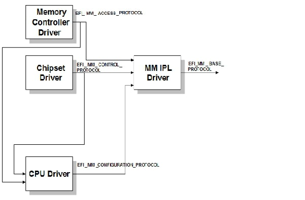
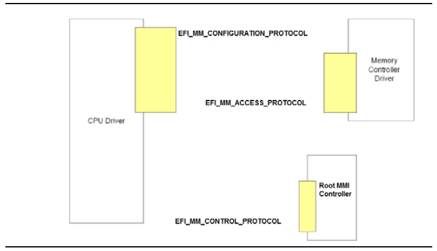
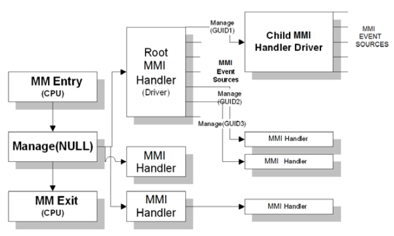

# RFC: MM Communicate Service

This document outlines the requirements and desiign for the **Communicate Service**. This service is responsible for
allowing non-Management Mode (MM) components to communicate with MMI handlers in MM.

## Technology Background

### System Management Mode (SMM)

System Management Mode (SMM) or Management Mode (MM) is a special-purpose operating mode in x86 architecture with high
execution privilege that is used to monitor and manage various system resources. MM code executes in a special region
of memory that is isolated from the rest of the system, and it is not directly accessible to the operating system or
other software running on the system. This region is called System Management RAM (SMRAM) or Mangagement Mode RAM
(MMRAM).

MM is entered by triggering a System Management Interrupt (SMI) also called a Management Mode Interrupt (MMI). The MMI
may be either triggered by software (synchronous) or a hardware (asynchronous) event. A MMI is a high priority,
non-maskable interrupt. On receipt of the interrupt, the processor saves the current state of the system and switches
to MM. Within MM, the code must set up its own execution environment such as applying an interupt descriptor table
(IDT), creating page tables, etc. It must also identify the source of the MMI to determine what MMI handler to invoke
in response.

---

Note: ARM platforms typically implement a MM environment using TrustZone (TZ). ARM platforms are not considered in this
current RFC.

---

**More details:**

- [Intel 64 and IA-32 Architectures Software Developer's Manual](https://www.intel.com/content/www/us/en/developer/articles/technical/intel-sdm.html)
- [Platform Initialization (PI) Specification](https://uefi.org/specifications)

### MM Communication

The *Communicate Protocol* is defined in the PI Specification as a service to allow non-MM components to communicate
(exchange data) with registered MM handlers. The `EFI_MM_COMMUNICATION_PROTOCOL` is responsible for performing any
copies of data such that the data resides in boot-services accessible memory.

Requirements for MM Communication:

- The MM communication implementation must have the ability to perform a mode transition to MM.
  - Note: This is often implemented in C code using the `EFI_MM_CONTROL_PROTOCOL`.
- The implementation must be in runtime code memory so that it can perform communication at runtime.
- The implementation must account for an arbitrary number of communication buffers to be defined that may be specified
  during MM Communication calls. For example, in an MM implementation with privilege separation, a "user" mode and
  "supervisor" mode communicate buffer may be defined.
- The communication implementation must account for being executed at runtime and/or being virtually mapped. The MM
  infrastructure must be assumed to be executing in physical mode. As a result, the non-MM agent which may be executing
  in virtual-mode OS context as a result of an OS invocation of the UEFI `SetVirtualAddressMap()` service, should use
  a contiguous memory buffer with a known physical address before invoking this service. The caller to the service must
  pass both the physical and virtual address of the buffer. They may be the same in case of identity mapping.
  - Note: If only the virtual address of the buffer is used, the MM agent may not be able to appropriately translate
    the virtual address to a physical address.
- The communicate buffer must always begin with a MM Communicate header per existing MM PI Specification
  requirements.
  - **COMPATIBILITY NOTE**: Although a V3 of the MM Communication Protocol is defined in the PI Specification, it has
    been very slowly adopted or not used at all. All upstream C-based modules are currently using *V2* with the
    exception of `Tcg2Acpi` and `UefiHandleParsingLib`. Therefore, the service must provide the flexibility to
    communicate to an MM implementation using the V1, V2, or V3 MM communication messaging format.

    - **V1 and V2** used the `EFI_MM_COMMUNICATE_HEADER` defined in the PI Specification as:

      ```c
      typedef struct {
        EFI_GUID                    HeaderGuid;
        UINTN                       MessageLength;
        UINT8                       Data[ANYSIZE_ARRAY];
      } EFI_MM_COMMUNICATE_HEADER;
      ```

      - `COMMUNICATE_HEADER_GUID` is defined in  the PI Specification as (`COMMUNICATE_HEADER_GUID`):

        `{0x99be0d8f, 0x3548, 0x48aa, {0xb5, 0x77, 0xfc, 0xfb, 0xa5, 0x6a, 0x67, 0xf7}}`

      - `HeaderGuid`
        - Allows for disambiguation of the message format. Used to identify the registered MM handlers that should
          be given the message.

      - `MessageLength`
        - Describes the size of Data (in bytes) and does not include the size of the header.

      - `Data`
        - Designates an array of bytes that is MessageLength in size.

    - **V3** uses `EFI_MM_COMMUNICATE_HEADER_V3`, defined in the PI Specification as:

      ```c
      typedef struct {
        EFI_GUID  HeaderGuid;
        UINT64    BufferSize;
        UINT64    Reserved;
        EFI_GUID  MessageGuid;
        UINT64    MessageSize;
        UINT8     MessageData[];
      } EFI_MM_COMMUNICATE_HEADER_V3;
      ```

      - `HeaderGuid`
        - Indicator GUID for MM core that the communication buffer is compliant with this v3 header. Defined in the
          Specification as (`COMMUNICATE_HEADER_V3_GUID`):

          `{0x68e8c853, 0x2ba9, 0x4dd7, {0x9a, 0xc0, 0x91, 0xe1, 0x61, 0x55, 0xc9, 0x35}}`

      - `BufferSize`
        - Technically a read-only field, which is described by the caller to indicate the size of the entire
          buffer (in bytes) available for this communication transaction, including this communication header.

      - `Reserved`
        - Reserved for future use.

      - `MessageGuid`
        - Allows for disambiguation of the message format.

      - `MessageSize`
        - Describes the size of MessageData (in bytes) and does not include the size of the header.

      - `MessageData`
        - Designates an array of bytes that is MessageSize in size.

## Goals

1. Provide a service to send arbitrary data contents to a targeted MMI handler.
2. Be compatible with the existing MM Communication implementations in MM code.
3. Provide a service that is usable in both boot and runtime environments.
   1. Usable in both virtual and physical address space.
   2. Resides in runtime code memory.

## Requirements

1. Must be able to be used in both boot and runtime environments.
2. Must be able to be used in both virtual and physical address space.
3. Must be able to be used in both 32-bit and 64-bit environments.

## Existing PI C Implementation







## Rust Code Design

```rust
pub trait MmCommunication {
    fn communicate(self, buffer: &[u8]) -> Result<(), Status>;
}
```

```rust
#[derive(Debug, Copy, Clone)]
pub struct CommunicateBuffer(&'static [u8]);

impl CommunicateBuffer {
    pub fn new(buffer: Pin<&'static [u8]>) -> Self {
        Self(Pin::into_inner(buffer))
    }
}
```

```rust
#[derive(IntoComponent, IntoService, Default)]
#[service(dyn MmCommunication)]
pub struct MmCommunicator{
    comm_buffers: Vec<CommunicateBuffer>,
}
```

```rust
pub trait MmAccess {
    fn trigger_smi(&self) -> Result<(), Status>;
}
```

```rust
#[derive(Debug, Copy, Clone)]
pub struct SmiPort(u8);

#[derive(Debug, Copy, Clone)]
pub enum AcpiBase {
    Mmio(usize),
    Io(u16),
}

#[derive(Debug, Copy, Clone)]
pub struct MmAccessorConfig {
    acpi_base: AcpiBase,
    cmd_port: SmiPort,
    data_port: SmiPort,
}

impl Default for MmAccessorConfig {
    fn default() -> Self {
        MmAccessorConfig {
            acpi_base: AcpiBase::Mmio(0),
            cmd_port: SmiPort(0xFF),
            data_port: SmiPort(0x00),
        }
    }
}
```

```rust
#[derive(Default, IntoComponent, IntoService)]
#[service(dyn MmAccess)]
pub struct MmAccessor{
    inner_config: MmAccessorConfig,
}
```
